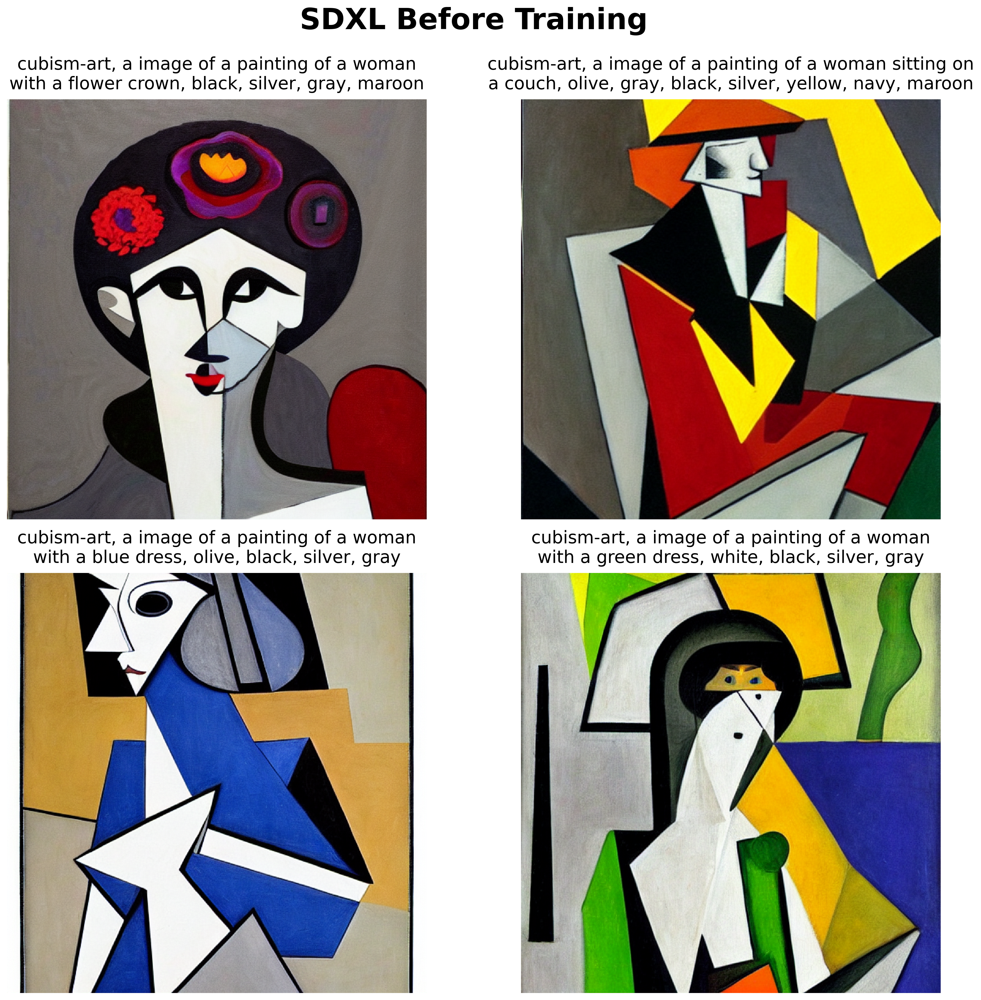

# Attaching controlNet into Stable Diffusion to finetune the model

## Dataset used
1. [lambdalabs/naruto-blip-captions](https://huggingface.co/datasets/lambdalabs/naruto-blip-captions)
2. [iamkaikai/CUBISM-ART](https://huggingface.co/datasets/iamkaikai/CUBISM-ART)

## LoRA Architecture

# Using Naruto Blip Dataset [1]
## SDXL Results
### Before Finetuning

## LoRA Results
### After Finetuning with LoRA

# Using Cubism Art Dataset [2]
## SDXL Results
### Before Finetuning

## LoRA Results
### After Finetuning with LoRA

### Disclaimer:
1. All the code is inside the notebook.
2. Parts of the code are copied from unsolved assignments of Prof. Minhyuk Sung @ KAIST, a graduate course about diffusion models.
3. Done during KAUST internship with KAUST GPUs @ Prof. Mohamed Elhoseiny Lab, as part of the learnings to create a diffusion project.
